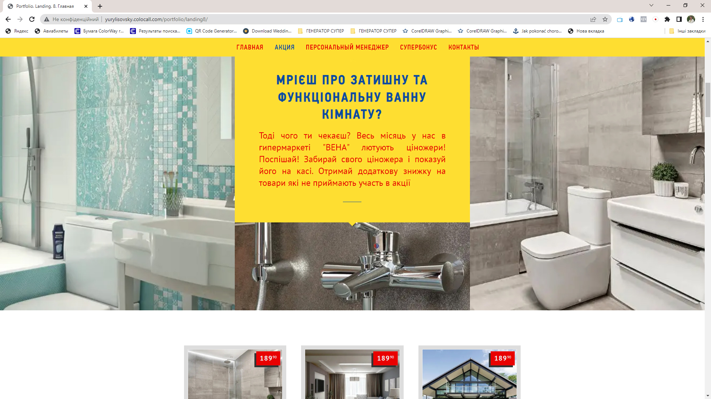
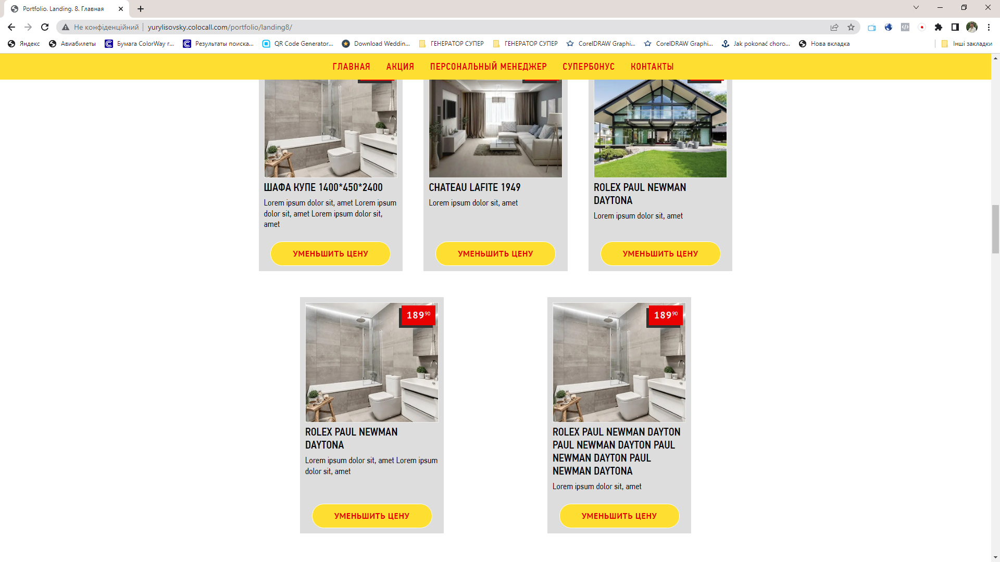
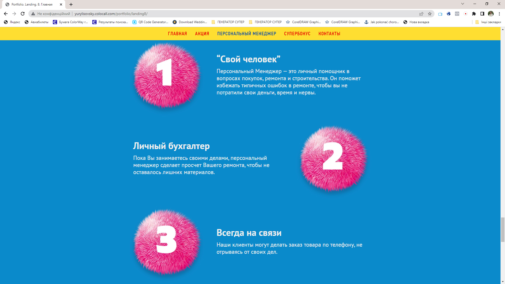
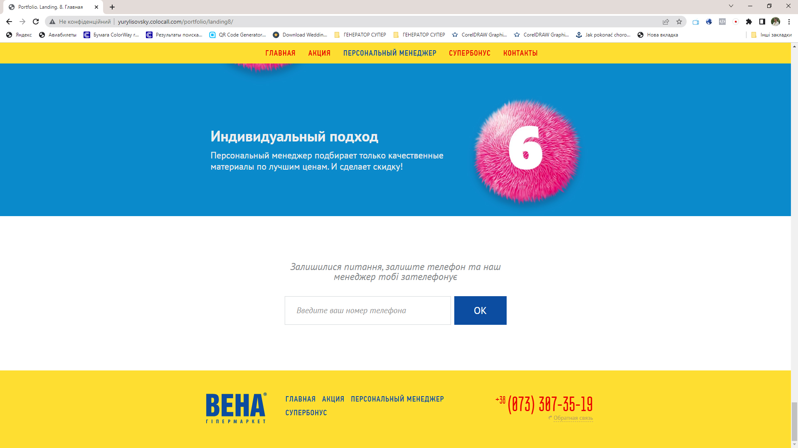
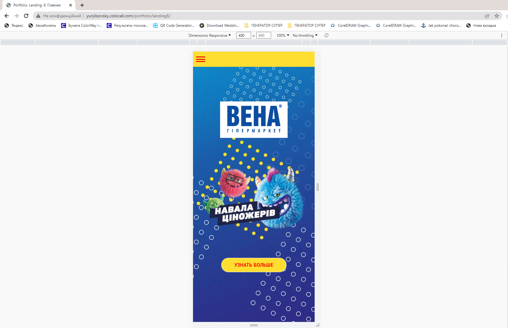
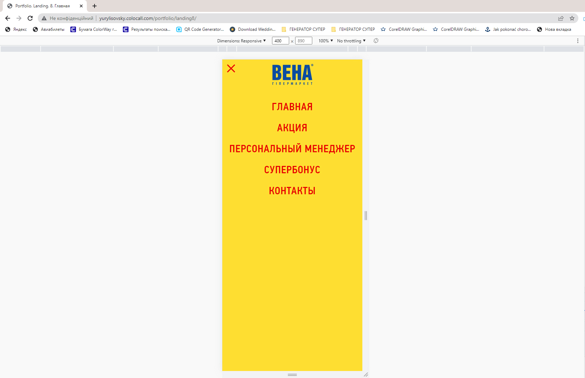
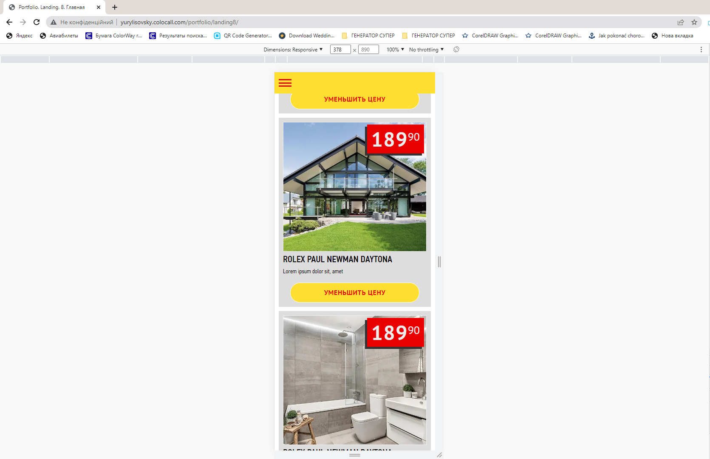
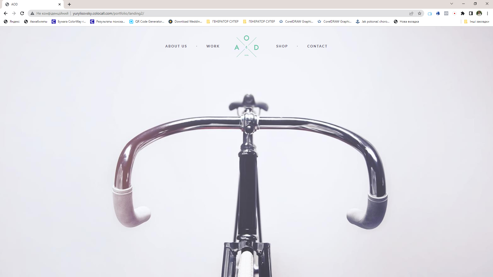

<h1 align="center">Training Project Vena Hot Sale</h1>

<!--  -->

<h2 align="center"><a  href="http://yurylisovsky.colocall.com/portfolio/landing8/">Watch project</a></h2>

## Description

This is a training project. Landing page for construction supermarket.
<!-- Це тренувальний проект. Сторінка лендінг для будівельного супермаркету. -->

## About the project.

This project is part of a training of skills in the course of study. It is designed to consolidate the skills of working with HTML, Javascript, jQuery, CSS.
Embedded slideshow features for the first screen. The project uses the construction of HTML-code of the page similar to BEM, SCSS and GULP technology.
Adaptive layout for different devices: smartphone, tablet, desktop computer.

<!-- Цей проект є частиною тренування навичок в курсі навчання. Він розроблений для закріплення навичок роботи з HTML, Javascript, jQuery, CSS. 
Втілені фуннкції слайдшоу для першого екрану. В проекті використана побудова HTML-коду сторінки аналогічно технології BEM, SCSS та GULP. 
Виконана адаптивна верстка під різні пристрої: смартфон, планшет, десктоп компьютер. -->

## This project used:

HTML, CSS, JavaScript, SCSS, jQuery, GULP

## Another similar project

### Landing 1

<h3 align="center"><a  href="http://yurylisovsky.colocall.com/portfolio/landing2/">Watch project</a></h3>
<h3 align="center"><a  href="https://github.com/yurlis/landing2-bike">Go to Landing project on GitHub</a></h3>

### Landing 2

<h3 align="center"><a  href="http://yurylisovsky.colocall.com/portfolio/landing4/">Watch project</a></h3>
<h3 align="center"><a  href="https://github.com/yurlis/landing4-luxshop">Go to Landing project on GitHub</a></h3>
